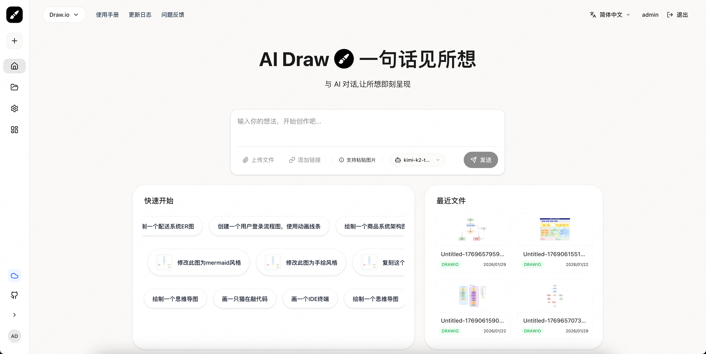
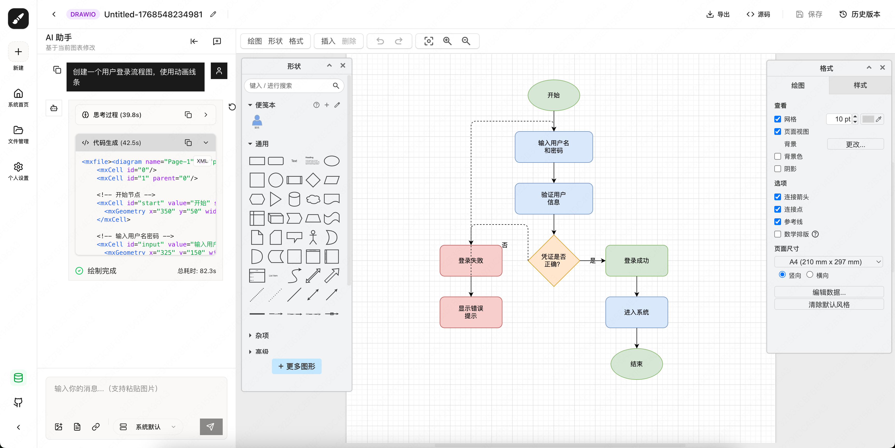
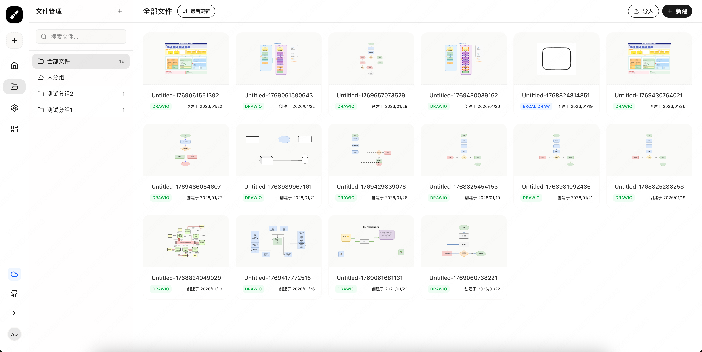
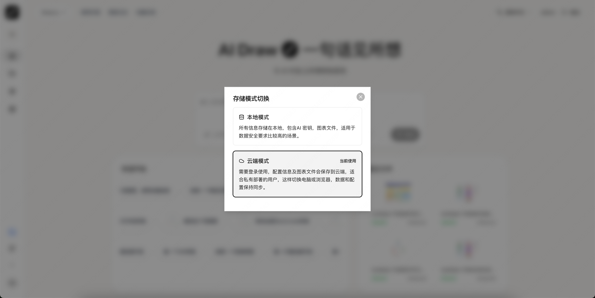
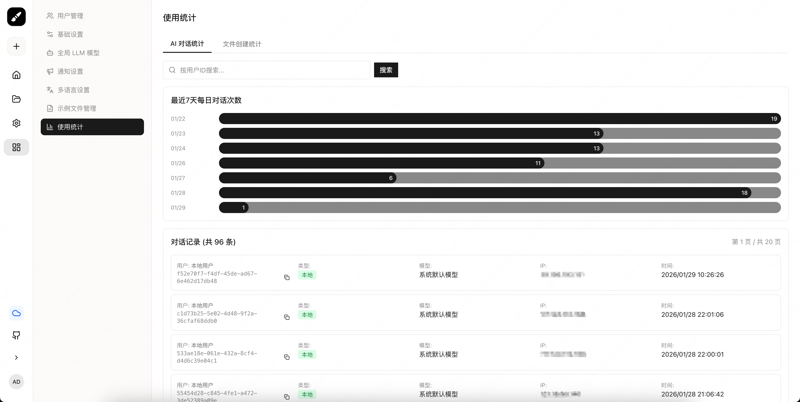

中文 | [English](./README_EN.md)

<p>An AI-powered diagram platform lets you describe charts in natural language and interact with AI for easy creation. It supports Mermaid, Excalidraw, and Draw.io engines. Users can privately deploy with Docker, store and manage diagram files, and choose between local or cloud use.

<p>AI驱动的图表创作平台，与AI对话，轻松使用Mermaid、Excalidraw和Draw.io绘图，支持docker私有部署、绘图文件存储和管理、本地和云端两种使用模式。


<div align=center>
  
  # AI Draw  一句话见所想


与 AI 对话，让所想即刻呈现

[](http://100qie.cn:3000)

中文 · [English](./README_EN.md) · [反馈问题][github-issues-link]

</div>

<p> AI Draw 是一个智能绘图平台，通过自然语言对话形式，即可快速生成流程图、时序图、架构图等各类图表，无需复杂的拖拽操作，让所想即刻呈现。支持 Mermaid、Excalidraw 和 Draw.io 三大引擎，支持docker私有部署，支持绘图文件存储和文件分组管理。
<p> 基于 next-ai-drawio 和 ai-draw-next 二次开发，增加文件管理、文件分组管理、本地/云端两种模式支持、动态绘图效果等功能，并调整较多交互，优化使用体验。

> \[!IMPORTANT]
>
> **收藏项目**，你将从 GitHub 上无延迟地接收所有发布通知～⭐️

## 💬 交流与反馈
您的反馈对我们非常重要。如果您在使用过程中遇到任何问题，或者有任何功能建议，可通过[github-issues][github-issues-link]反馈问题，同时可通过以下方式在线联系我们。
<center class="half">
    
</center>

## ✨ 系统一览
<center class="half">
    
    
</center>
<center class="half">
    
    
    
</center>

## 视频片段

<video controls width="600">
  <source src="./public/readme/zh-视频.mp4" type="video/mp4">
  您的浏览器不支持 video 标签。
</video>

## 🛳 开箱即用- 私有部署 Docker Compose （推荐）

**1. docker部署并启动项目**
> \[!TIP]
>
> 镜像地址国内使用**阿里云镜像地址**下载速度会更快： registry.cn-hangzhou.aliyuncs.com/stone-yu/ai-draw:latest

```bash
version: '3.8'

services:
  ai-draw:
    build: .
    image: ghcr.io/stone-yu/ai-draw:latest
    container_name: ai-draw
    restart: unless-stopped
    ports:
      - "3000:3000"
    volumes:
      # Map local data directory to container data directory
      # On NAS, change ./data to your actual path, e.g., /volume1/docker/aidraw/data
      - ./data/aidraw:/app/data
    environment:
      - PORT=3000
      - DATA_DIR=/app/data
      - DEBUG=false
```

**2.访问地址：** 访问http://<NAS_IP>:3000即可使用，数据将保存在项目目录下的/app/data文件夹中；

**3.管理员登录：** 登录默认管理员账号：admin/admin123，登录后及时更改密码；**

**4.设置全局LLM模型：** 左侧系统设置-全局LLM模型，填写信息；

## 🛠️ 本地开发

**1.启动项目**

```bash
git clone https://github.com/stone-yu/ai-draw
cd ai-draw
pnpm install

# 同时启动前端和后端
pnpm run dev
# 访问 http://localhost:8787

# 或者分别启动：
pnpm run dev:frontend   # 仅 Vite (http://localhost:5173)
pnpm run dev:backend    # 仅 Wrangler Pages (http://localhost:8787)
```
**2.访问控制台上的前端地址，数据将保存在项目目录下的/app/data文件夹中；**

**2.管理员登录：** 登录默认管理员账号：admin/admin123，登录后及时更改密码；**

**3.设置全局LLM模型：** 左侧系统设置-全局LLM模型，填写信息；

## 🧩 技术栈

- **前端**：React 19 + Vite + TypeScript + Tailwind CSS
- **状态管理**：Zustand
- **本地存储**：Dexie.js (IndexedDB)
- **图标库**：Lucide React

## 支持的 AI 服务

| 服务商 | AI_PROVIDER | AI_BASE_URL | 推荐模型 |
|--------|-------------|-------------|----------|
| OpenAI | openai | https://api.openai.com/v1 | gpt-5 |
| Anthropic | anthropic | https://api.anthropic.com/v1 | claude-sonnet-4-5 |
| 其他兼容服务 | openai | 自定义 URL | - |


## 📈 Star History

[](https://www.star-history.com/#stone-yu/ai-draw&type=date&legend=top-left)


## 开源协议

MIT
